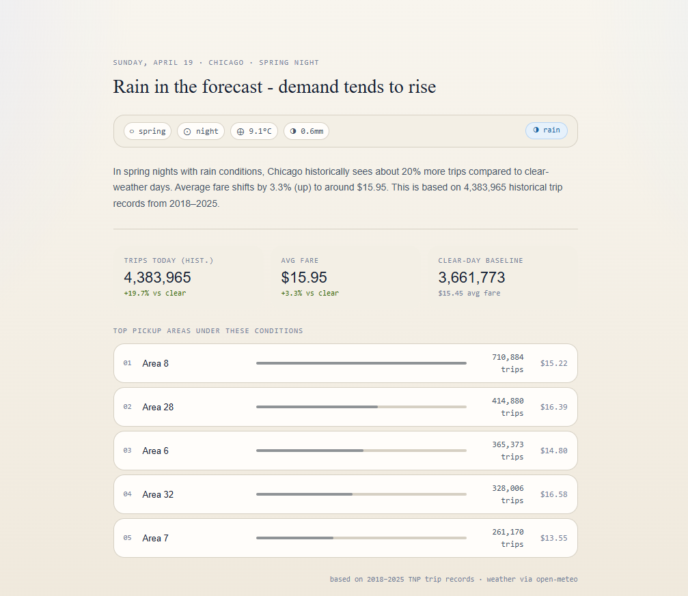

# Mobility Alarm

## Weather-driven ride demand signal for Chicago

Mobility Alarm is a small full-stack project that estimates how today's weather can affect ride demand in Chicago. It combines historical TNP trip data with live weather data, stores pre-aggregated results in a database, exposes them through a FastAPI backend, and presents the insight in a React frontend.

Example with a raining conditions

## How to run

Before starting the apps, run the ETL pipeline first. This project depends on the database produced by `backend/domain/etl/runner.py`.

1. Open a terminal in `C:\projects\uber_test\backend`
2. Run the ETL script:

```bash
python -m domain.etl.runner
```

This step downloads the large source files, fetches weather data, transforms the raw data, and writes aggregated results into the local SQLite database. The full fetch can take around 2 hours.

3. Start the backend API from `C:\projects\uber_test\backend`:

```bash
uvicorn app.main:app --reload
```

4. Start the frontend from `C:\projects\uber_test\frontend`:

```bash
npm install
npm run dev
```

By default, the frontend reads the API URL from `VITE_API_URL` and falls back to `http://localhost:8000`.

## Project structure

```text
uber_test/
|- backend/
|  |- app/
|  |  |- main.py                # FastAPI entrypoint
|  |  |- routers/               # API routes
|  |  |- services/              # business logic for weather and insight endpoints
|  |  |- models/                # response schemas
|  |  `- tools/data_formatter.py
|  |- domain/
|  |  `- etl/
|  |     |- runner.py           # ETL entrypoint
|  |     |- downloader.py       # raw data download helpers
|  |     |- weather_client.py   # weather fetcher
|  |     |- transformer.py      # aggregation + DB load
|  |     `- db_schema.py        # SQLite schema creation
|  `- tnp_trips.db              # generated local database
|- frontend/
|  |- src/
|  |  |- App.jsx
|  |  `- WeatherInsight.jsx     # main dashboard component
|  `- package.json
`- README.md
```

## Chosen alert

The chosen alert is bad weather. The application computes a `weather_mark` and uses it to compare historical ride demand for similar weather conditions against clear-weather days.

The weather mark is computed with a simple priority-based rule:

- `snow` if snowfall is greater than 0
- `rain` if precipitation is greater than 0 and there is no snow
- `extreme temperature` if there is no precipitation and the temperature is outside the seasonal threshold
- `clear` otherwise

Seasonal temperature thresholds are:

- winter: below `-10 C`
- spring: below `2 C`
- summer: above `32 C`
- fall: below `2 C`

This means each day is grouped into one weather category that can be matched with historical ride data for the same season and part of day.

## What could make it wrong

Weather is only one part of mobility demand. Not every increase or decrease in rides is caused by rain, snow, or extreme temperature. The prediction can be inaccurate because of factors such as:

- public events
- concerts or sports games
- holidays
- strikes or transit disruptions
- unusual traffic conditions

Because those signals are not included in the current model, the weather-based insight should be treated as a focused heuristic rather than a complete demand forecast.

## Solution explanation

### 1. Fetching big data files

The ETL layer in `backend/domain/etl/runner.py` starts the pipeline. It applies the database schema, launches concurrent downloads for the historical trip datasets, and fetches weather data from the weather service. Because the source files are large, the initial data download and preparation process takes around 2 hours.

#### How concurrent downloading works

All network I/O is handled in `download_orchestrator.py` using a single `asyncio.gather()` call, which means the weather request and every CSV download run in parallel - total wall-clock time equals the slowest individual download, not their sum.

A shared `aiohttp.ClientSession` (with a `certifi`-backed SSL context) is created once and passed to every coroutine, keeping connection overhead low.

**Weather data** (`weather_client.py`) - a single request is sent to the Open-Meteo archive API for the full date range (`weather_start` -> today). The response contains daily `temperature_2m_max`, `precipitation_sum`, and `snowfall_sum` values for Chicago, which are immediately converted into integer `weather_mark` codes and stored in a `{YYYY-MM-DD: int}` dictionary.

**Trip CSVs** (`downloader.py`) - one coroutine is spawned per dataset. Each coroutine streams the Socrata endpoint in 1 MB chunks directly to disk (`csv_dir/tnp_{name}.csv`), logging progress every 60 seconds so long-running downloads stay visible in the logs. If a file is already present on disk the download is skipped entirely, which makes re-runs after a partial failure much faster.

### 2. Writing aggregated data to the database

After downloading, the transformer processes the raw CSV files and joins them with weather information. The pipeline writes aggregated results into a local SQLite database and prepares the `trips_summary` view used by the API. Instead of querying raw trip rows on every request, the project stores already summarized data, which makes the API faster and simpler.
### 3. API flow

The FastAPI app opens the SQLite database on startup and validates that the required summary view exists. The `/api/insight` endpoint then:

- fetches current weather
- computes the current weather mark
- queries historical averages for the same season, time of day and weather mark
- compares them to a clear-weather baseline
- returns a response containing headline text, reasoning, city-level metrics and top pickup areas

### 4. Frontend flow

The React frontend calls `/api/insight` and renders the main insight card. The UI shows:

- current season
- current part of day
- current temperature
- precipitation amount when present
- snowfall amount when present
- computed weather label
- generated headline
- explanation text
- historical average trips for the current weather condition
- average fare
- clear-weather baseline
- trip delta versus clear weather
- fare delta versus clear weather
- top pickup areas with trip counts and average fares

## Current bottlenecks and future upgrades

- Using a local SQLite database is not the best long-term decision. A better option would be an external database running in Docker, such as PostgreSQL
- Data fetching is triggered by a separate script. A better user flow would be a button in the application that triggers an API request for refresh
- PySpark would likely be a better solution for large-scale data processing, but it was not chosen because of library instability and time limits
- The frontend does not currently explain clear-weather days in as much detail, because the app focuses mainly on weather anomalies and compares them against clear-day baselines
- Tests were not implemented because of time limits
- K-means algorithm was tested on the data to define the weather conditions based on the precipitation, temperature, snowfall, but were not chosen as a production approach due to highly correlated temporal sequences, and irregular weather regime shapes
- Dockerization is preferable, but not implemented due to time limits
